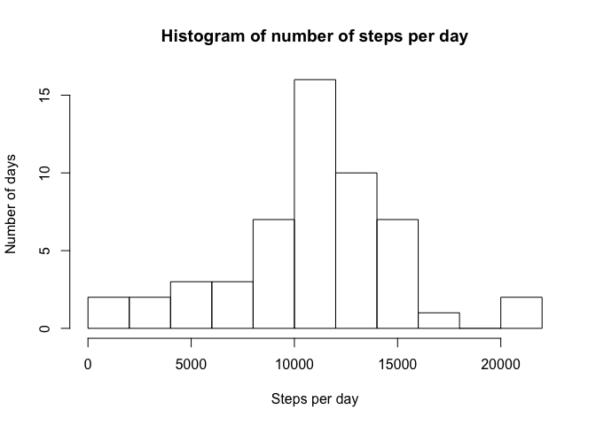
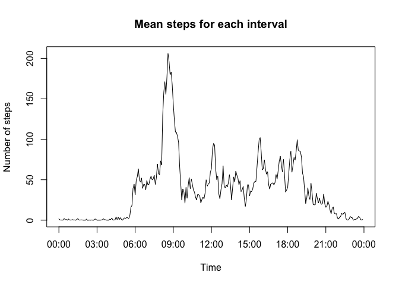
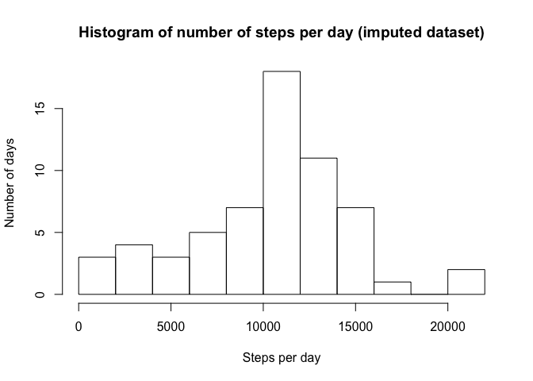
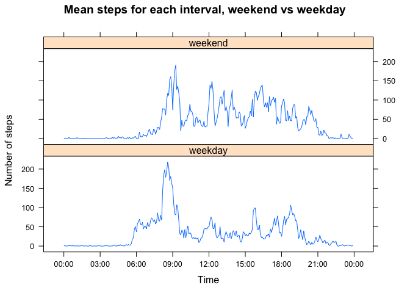

# Reproducible Research: Peer Assessment 1 by Martin Baker

## Loading and preprocessing the data
We start with the data as a zip file. We need to use the `unz()` function to access the CSV file in the zip:


```r
activityTable <- read.csv(unz("activity.zip", "activity.csv"))
str(activityTable)
```

```
## 'data.frame':	17568 obs. of  3 variables:
##  $ steps   : int  NA NA NA NA NA NA NA NA NA NA ...
##  $ date    : Factor w/ 61 levels "2012-10-01","2012-10-02",..: 1 1 1 1 1 1 1 1 1 1 ...
##  $ interval: int  0 5 10 15 20 25 30 35 40 45 ...
```

Now we need to pre-process the data in a couple of different ways. First of all, the dates are factors. We want
them as Date objects. Secondly, the intervals are integers, but they represent clock values (135 represents
1:35 am -
you'll notice there is no 60 or 160 interval). We want to turn those into true integers - the number of minutes
since the start of the day. We effect these two transformations like so:


```r
activityTable$date <- as.Date(activityTable$date)
# This one's a little more complicated - interpret it as a string, break into two, then
# back into an integer:
minutesSinceStartOfDay <- function(intervalAsClockTime) {
        if (intervalAsClockTime < 100) {
                # This is easy; no hour (hour = 0), so just return our input
                return(intervalAsClockTime)
        }
        intervalString <- toString(intervalAsClockTime)
        stringLength <- nchar(intervalString)    # will be at least 3
        hours <- as.integer(substr(intervalString, 1, stringLength - 2))
        minutes <- as.integer(substr(intervalString, stringLength - 1, stringLength))
        return(hours * 60 + minutes)
}
# For future use, to convert back to clock time as needed:
clockTimeForMinutes <- function(totalMinutes) {
        totalMinutes <- totalMinutes %% (24 * 60)
        hours <- trunc(totalMinutes / 60)
        minutes <- totalMinutes %% 60
        sprintf("%02d:%02d", hours, minutes)
}
activityTable$intervalStartInMinutes <- sapply(activityTable$interval, minutesSinceStartOfDay)
activityTable <- subset(activityTable, select=-c(interval))
str(activityTable)
```

```
## 'data.frame':	17568 obs. of  3 variables:
##  $ steps                 : int  NA NA NA NA NA NA NA NA NA NA ...
##  $ date                  : Date, format: "2012-10-01" "2012-10-01" ...
##  $ intervalStartInMinutes: num  0 5 10 15 20 25 30 35 40 45 ...
```
## What is mean total number of steps taken per day?
To calculate the total number of steps per day, we group by day and sum steps. We'll create a histogram and
calculate the mean and median.

```r
stepsPerDay <- aggregate(. ~ date, data=activityTable, FUN=sum)[, "steps"]
meanStepsPerDay <- mean(stepsPerDay)
medianStepsPerDay <- as.integer(median(stepsPerDay))
hist(stepsPerDay, 8, xlab="Steps per day", ylab="Number of days",
     main="Histogram of number of steps per day")
```

 

The mean steps per day is `sprintf("%.1f", meanStepsPerDay)` = 10766.2 and the
median is `medianStepsPerDay` = 10765.
These are very similar, so we can infer that the data is evenly divided around the mean (the histogram
supports this).


## What is the average daily activity pattern?
Find the mean of steps for each interval over all days, and the interval with the highest mean:

```r
meanStepsPerInterval <- aggregate(. ~ intervalStartInMinutes, data=activityTable, FUN=mean)

maxMeanStepsIndex <- which.max(meanStepsPerInterval$steps)
maxMeanStepsIntervalStart <- meanStepsPerInterval[maxMeanStepsIndex, "intervalStartInMinutes"]

plot(meanStepsPerInterval$intervalStartInMinutes, meanStepsPerInterval$steps, type="l",
     xlab="Time", ylab="Number of steps", main="Mean steps for each interval", xaxt='n')
axis(1, seq(0, 24 * 60, 180), sapply(seq(0, 24 * 60, 180), clockTimeForMinutes))
```

 

The interval with the most steps, on average, is `maxMeanStepsIntervalStart` = 515
minutes from the start of the day; in other words, 08:35 (`clockTimeForMinutes(maxMeanStepsIntervalStart)`).

Note that this graph does not have little horizontal jags the way that the example image does in the
Github README file. Those jags are from the gaps introduced by treating the clock-time interval as an integer
- there are gaps between 55 and 100, 155 and 200, and so on. This graph avoids those jags by treating intervals
as "minutes since the start of the day". This is the reason for that preprocessing step.


## Imputing missing values
It's very easy to find the number of rows with NA values:

```r
sum(is.na(activityTable))
```

```
## [1] 2304
```

Let's take a look at where the NA values are. Let's sum up the NA values per day:


```r
naTable <- activityTable
naTable$isNa <- is.na(naTable$steps)
# remove the steps column so that aggregate/sum doesn't skip over a day of all NAs:
naTable <- subset(naTable, select=-steps)
naStepsPerDay <- aggregate(. ~ date, data=naTable, FUN=sum)
levels(as.factor(naStepsPerDay$isNa))
```

```
## [1] "0"   "288"
```

The number of intervals in a day is 288 (24 hours times 12 five-minute intervals per hour). So this means
that every day has either full data or no data at all. Therefore a strategy of looking at neighbouring
intervals is not going to work.

I'm going to choose the following strategy: any missing interval will use the average of the values at the same
interval from the day before and the day
after. As it turns out, two of the missing days are the first day and the last day; in those cases (by using
the `na.rm=T` option to `mean()`), this algorithm will just use the values for the second day and the
second-to-last day, respectively.


```r
# I'm sure there's a cleaner, more vector-y way to do this, but this gets the job done:
imputedActivityTable <- activityTable
for (i in 1:nrow(imputedActivityTable)) {
        if (is.na(imputedActivityTable[i, "steps"])) {
                interval <- imputedActivityTable[i, "intervalStartInMinutes"]
                date <- imputedActivityTable[i, "date"]
                yesterdayInterval <- (imputedActivityTable$date == date - 1 &
                                             imputedActivityTable$intervalStartInMinutes == interval)
                tomorrowInterval <- (imputedActivityTable$date == date + 1 &
                                             imputedActivityTable$intervalStartInMinutes == interval)
                neighbouringDaySteps = c(imputedActivityTable[yesterdayInterval, "steps"],
                                         imputedActivityTable[tomorrowInterval, "steps"])
                imputedActivityTable[i, "steps"] <- mean(neighbouringDaySteps, na.rm=T)
        }
}
# Verify that we don't have any NAs left:
if (sum(is.na(imputedActivityTable)) > 0) {
        stop("Interpolation function did not fill in all gaps; investigate. Probably a run of three or more
             NA-days.")
}

# Now repeat the analysis in the first step with our new dataset:
stepsPerDayImputed <- aggregate(. ~ date, data=imputedActivityTable, FUN=sum)[, "steps"]
meanStepsPerDayImputed <- mean(stepsPerDayImputed)
medianStepsPerDayImputed <- as.integer(median(stepsPerDayImputed))
hist(stepsPerDayImputed, 8, xlab="Steps per day", ylab="Number of days",
     main="Histogram of number of steps per day (imputed dataset)")
```

 

The mean steps per day is `sprintf("%.1f", meanStepsPerDayImputed)` =
10295.5 and the median is `medianStepsPerDayImputed` =
10571. We can see that these values are lower than those in step 1; imputing the
missing data has lowered our estimates of mean total daily steps.

## Are there differences in activity patterns between weekdays and weekends?

Let's create a new column with a value of either "weekend" or "weekday" and then create a panel plot to
compare the two:


```r
daytype <- function(date) {
        if (weekdays(date) %in% c("Saturday", "Sunday")) {
                return("weekend")
        } else {
                return("weekday")
        }
}
imputedActivityTable$daytype <- as.factor(sapply(imputedActivityTable$date, daytype))

meanStepsPerIntervalPerDaytype <- aggregate(. ~ intervalStartInMinutes + daytype,
                                            data=imputedActivityTable, FUN=mean)

library(lattice)
xyplot(steps ~ intervalStartInMinutes | daytype, meanStepsPerIntervalPerDaytype, type="l", layout=c(1,2),
       xlab="Time", ylab="Number of steps", main="Mean steps for each interval, weekend vs weekday",
       scales=list(
               x=list(
                       at=seq(0, 24 * 60, 180),
                       labels=sapply(seq(0, 24 * 60, 180), clockTimeForMinutes))))
```

 

The two plots have a similar shape, but we can see some differences. The early-morning peak is higher on
weekdays and starts earlier, presumably reflecting a earlier wake time and travel to work. Far more of the
remaining intervals are low on the weekdays compared to the weekend, perhaps a result of a sedentary work
environment during the week. The evening peak occurs later on the weekend. This may reflect staying up later
on the weekend, although to investigate that question it would make sense to alter the analysis to group
Friday night with the weekend and Sunday night with the weekdays.
